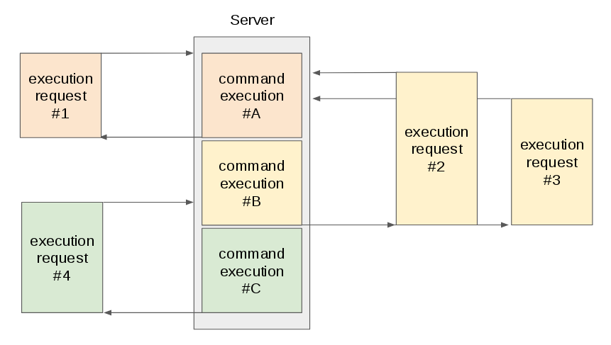

# httpexec

httpexec expose a single static system call on http api, with a mechanism to ensure one at a time execution.


## How to run

Start http server

```
$ ./httpexec start 8080 'echo "Hello World !"'
``` 

Call

```
$ curl "http://localhost:8080/"
"Hello World !"


$ curl -sI "http://localhost:8080/" | grep HTTP
HTTP/1.1 200 OK
```


Start http server with failing command

```
$ ./httpmexec start 8080 '/bin/false'
``` 


```
$ curl  "http://localhost:8080/" 
exit status 1


$ curl -sI "http://localhost:8080/" | grep HTTP
HTTP/1.1 500 Internal Server Error

```


## One at a time execution

1. On first exec request, the command is executed immediately.
2. Next exec request are enqueued.
3. When command ends, first exec request gets a response.
4. Then the command is executed again.
5. When command ends, all enqueued request (see 2.) get the response.

